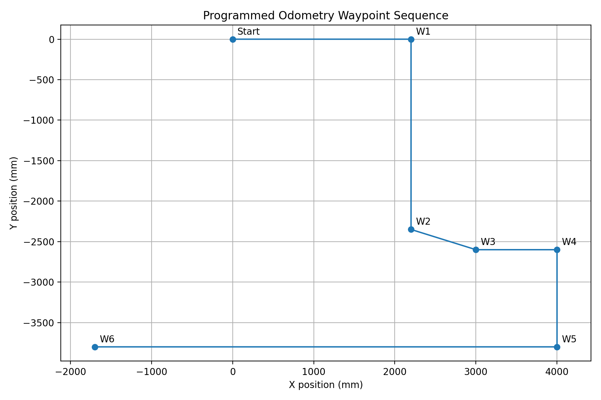
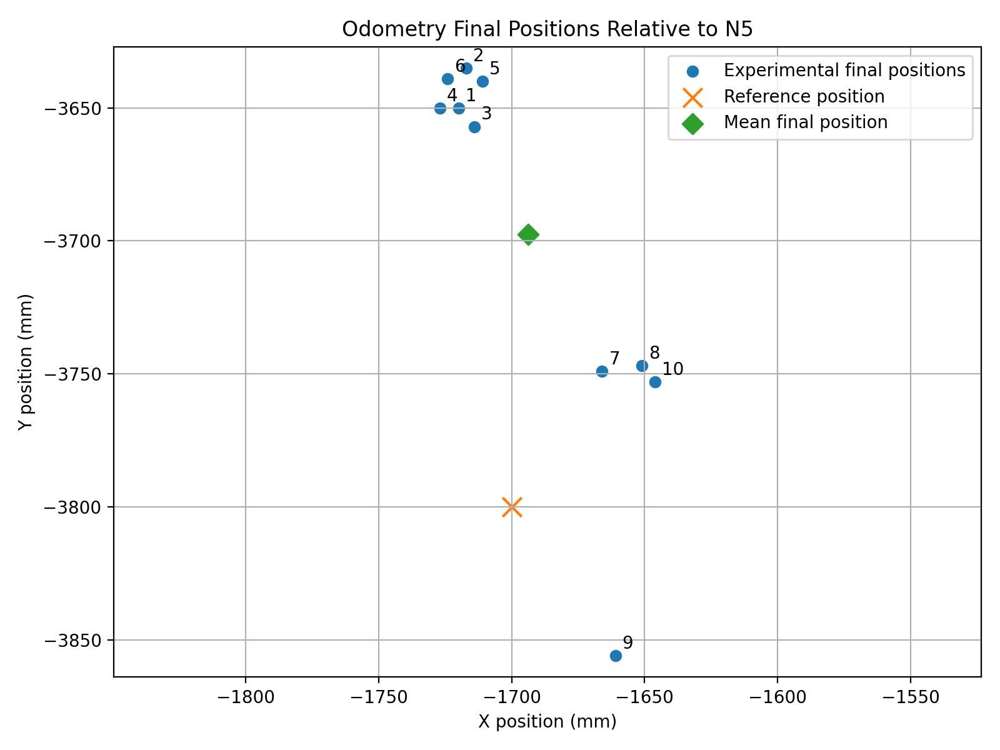
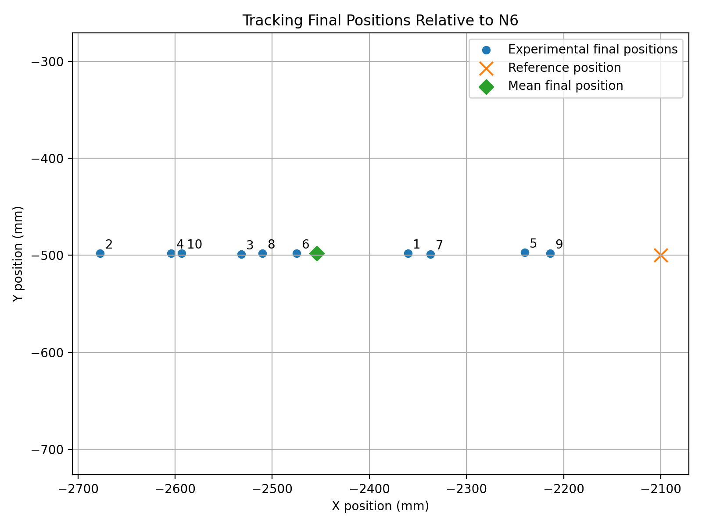
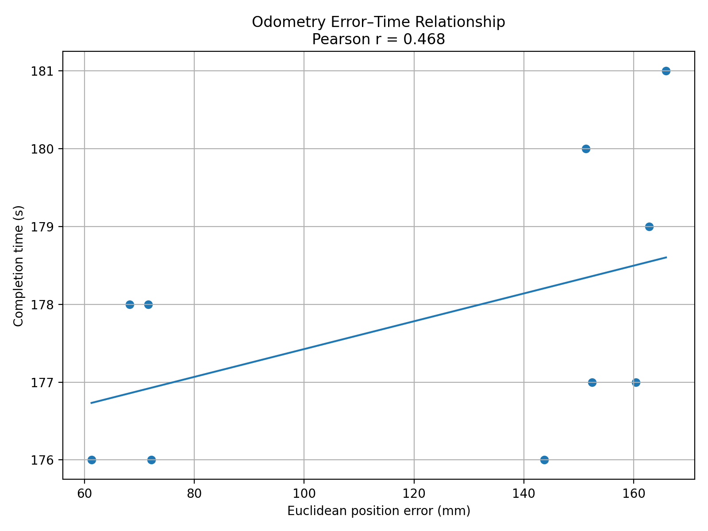
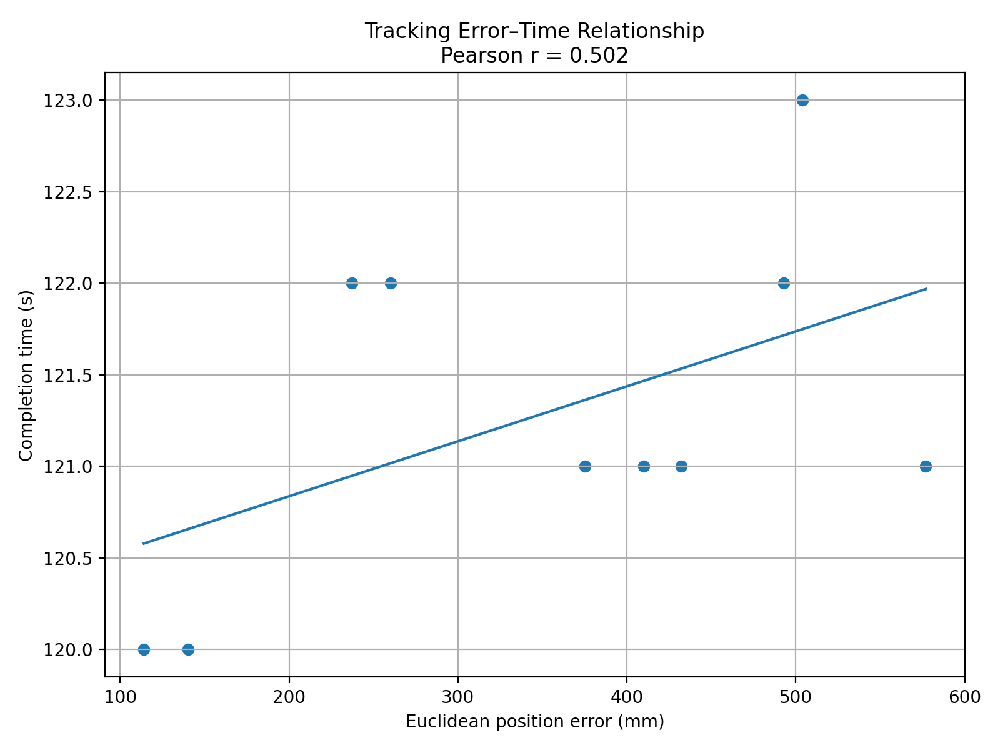

# Pioneer P3-DX Robot Navigation, Tracking and Mapping

**Author:** Jesutomito Morakinyo  
**Project type:** University robotics coursework  
**Platform:** Pioneer P3-DX using a university-provided ARIA/Java framework

## Project overview

This project implements and evaluates autonomous behaviours for a Pioneer
P3-DX mobile robot. The robot first follows a sequence of odometry waypoints,
then tracks a visual target while using sonar sensing for obstacle avoidance.
The program also transforms sonar measurements into global coordinates for
mapping and plots the robot's movement through the environment.

The university framework supplied the robot, sensor, control and plotting
interfaces. My project contribution focused on:

- defining and implementing the waypoint-navigation behaviour;
- calculating desired headings and position errors;
- implementing angular and linear destination checks;
- adapting sonar-based obstacle avoidance and collision escape behaviour;
- implementing camera/blob target tracking;
- applying sonar coordinate transformations for mapping;
- defining the navigation route and end-zone conditions;
- conducting repeated odometry and tracking experiments;
- analysing Euclidean error, completion time, mean, standard deviation and
  distance–time correlation.

See [`NOTICE.md`](NOTICE.md) for framework attribution and repository scope.

## Behaviour sequence

```text
Initial robot position
        ↓
Waypoint navigation using odometry
        ↓
Programmed waypoint sequence to the N5 odometry destination
        ↓
Enter tracking phase
        ↓
Visual target tracking + sonar obstacle avoidance
        ↓
Reach the N6 end-zone region
        ↓
Robot shutdown
```

## Main implementation

### Waypoint navigation

`navigate()` uses TURN and MOVE states for waypoint navigation. An AVOID state is also defined in the source, while the active program flow calls the obstacle-avoidance method separately during the tracking phase from `Run.java`. At each
waypoint, the robot:

1. calculates the required heading with `atan2`;
2. turns until it is within the angular tolerance;
3. moves forward until it is within the linear tolerance;
4. advances to the next waypoint.

The planned route is defined by the `NODE` coordinate array in
[`src/LabExercises.java`](src/LabExercises.java).



### Obstacle avoidance

`avoid()` uses the front-left and front-right sonar groups. It turns away from nearby obstacles, attempts to escape corner conditions and performs a reverse and random-turn escape action if the robot is stationary away from its initial pose.

### Visual target tracking

`track()` divides the detected blob position into left, middle and right image
zones. The robot turns toward the target and approaches it until the front
sonars detect that it is within the stopping threshold.

### Mapping

`mapBuilder()` converts sonar detections from local sensor coordinates to the
robot frame and then to global map coordinates before adding the points to the
scatter plot.

## Experimental evaluation

Ten runs were recorded for both phases:

- **Odometry:** initial position to N5, reference endpoint
  `(-1700, -3800)` mm.
- **Tracking:** N5 to N6, reference endpoint `(-2100, -500)` mm.

Euclidean endpoint error was calculated as:

```text
d = sqrt((x - x_reference)^2 + (y - y_reference)^2)
```

| Phase | Mean error (mm) | Error SD (mm) | Mean time (s) | Time SD (s) | Pearson r |
|---|---:|---:|---:|---:|---:|
| Odometry | 120.98 | 45.83 | 177.8 | 1.75 | 0.468 |
| Tracking | 354.21 | 158.85 | 121.3 | 0.95 | 0.502 |

The original experiment workbook and derived CSV tables are available under
[`experiments/`](experiments/).

### Final-position distributions





### Error–time relationships





## Repository structure

```text
pioneer-p3dx-robot-navigation/
├── src/
│   ├── LabExercises.java
│   └── Run.java
├── experiments/
│   ├── robot_navigation_results.xlsx
│   ├── odometry_results.csv
│   ├── tracking_results.csv
│   ├── summary_statistics.csv
│   └── README.md
├── results/
│   ├── planned_odometry_route.png
│   ├── odometry_final_positions.png
│   ├── tracking_final_positions.png
│   ├── odometry_distance_time_correlation.png
│   └── tracking_distance_time_correlation.png
├── docs/
│   ├── IMPLEMENTATION.md
│   ├── EXPERIMENT_METHOD.md
│   └── RESULTS.md
├── NOTICE.md
├── .gitignore
└── README.md
```

## Running the code

The two Java classes depend on the university-provided project environment,
including:

- `robot.Robot`
- `robot.Sensor`
- `utils.Delay`
- `utils.ScatterPlotter`
- `ControlPanel`
- JFreeChart/JFreeUI
- the ARIA robot interface

These framework files and libraries are not included in this repository.
To run the project, place `LabExercises.java` and `Run.java` in the original
university framework project, configure the Pioneer/ARIA simulator or robot
connection and run `Run.java`.

## Scope

The workbook records final coordinates and completion times for each
experimental run. The repository therefore presents the programmed waypoint
route and the measured final-position distributions. It does not infer
unrecorded continuous trajectories.
